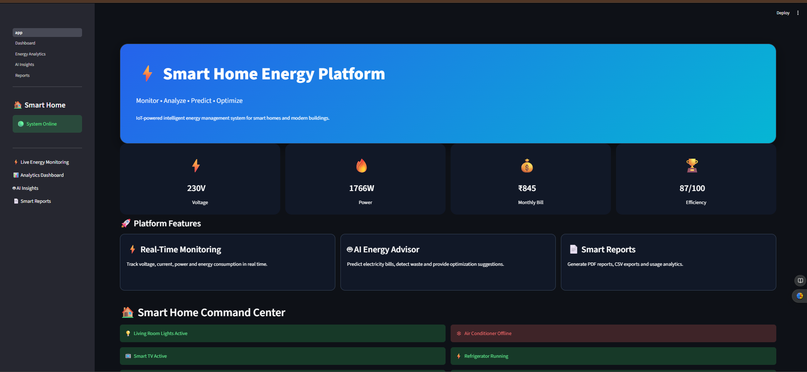
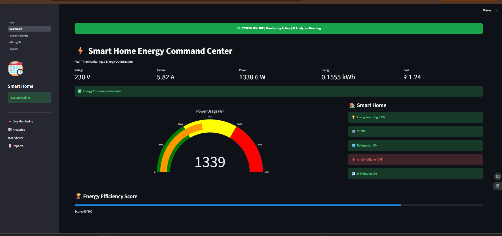
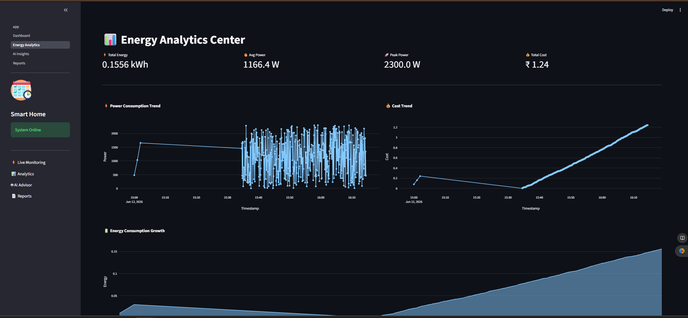
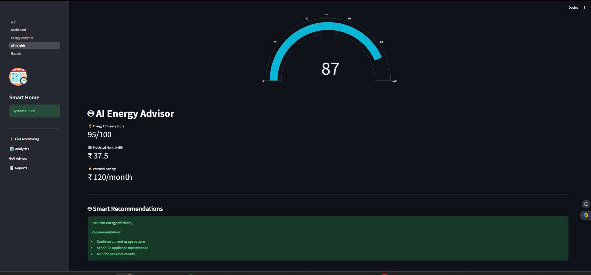
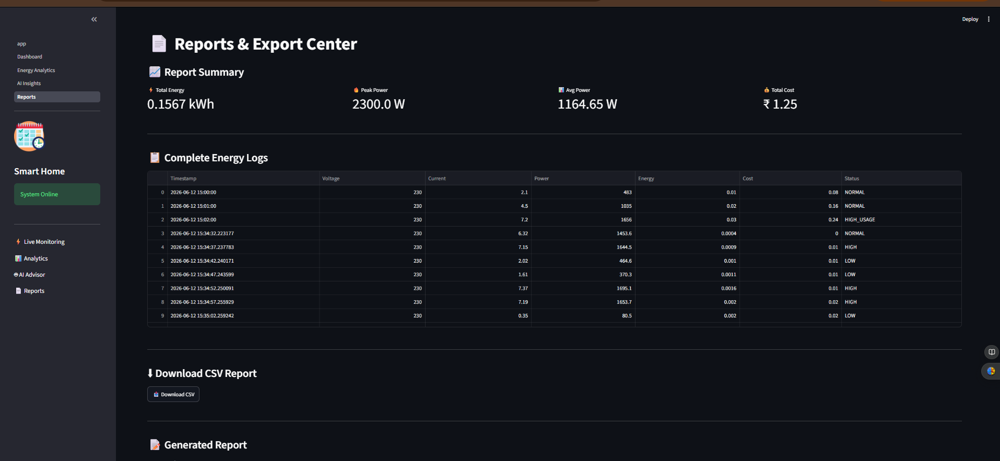
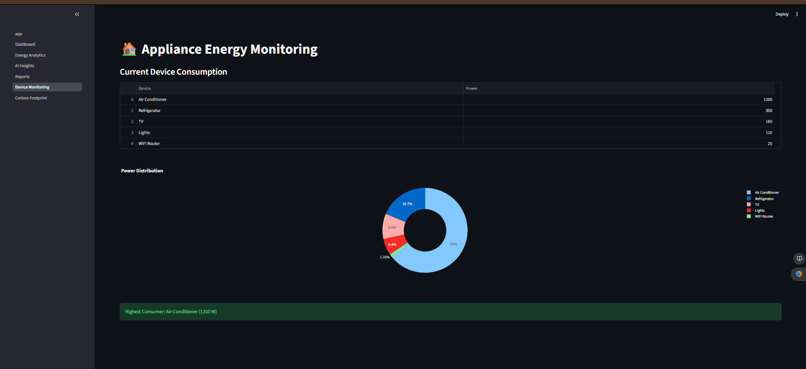
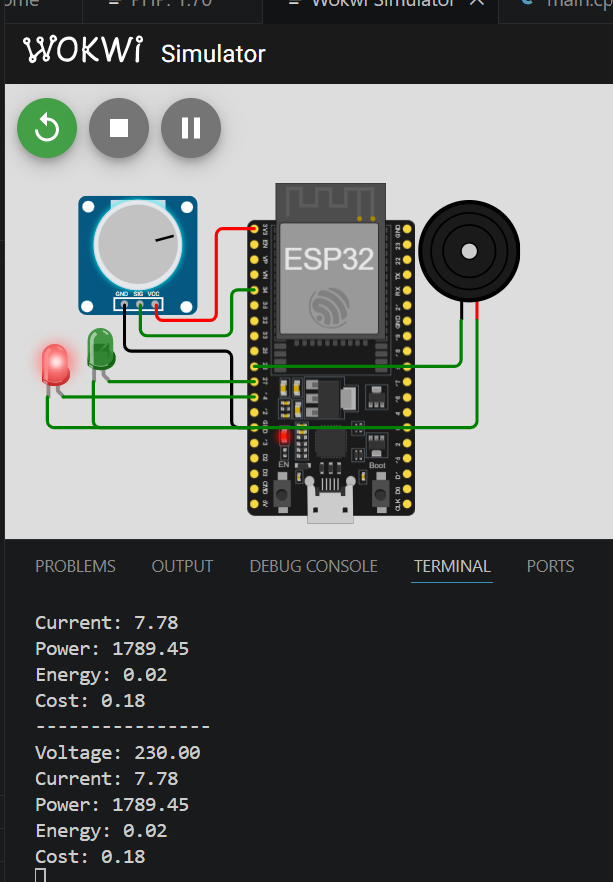
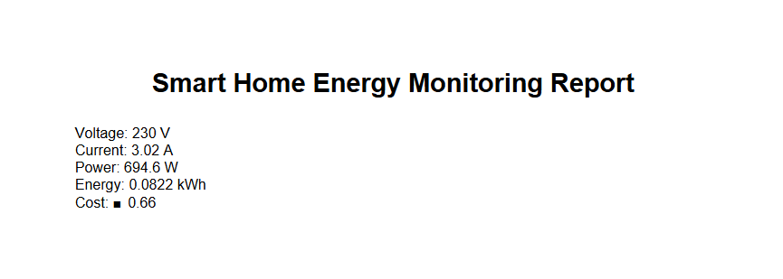

# ⚡ IoT Smart Home Energy Monitoring System

## 📌 Overview

The **IoT Smart Home Energy Monitoring System** is an intelligent energy management platform designed to monitor, analyze, and optimize household energy consumption.

The system uses an **ESP32-based IoT architecture**, simulated using **Wokwi**, to monitor electrical parameters such as voltage, current, power consumption, energy usage, electricity cost, appliance status, and environmental impact.

A modern **Streamlit Dashboard** provides real-time monitoring, analytics, AI-driven insights, report generation, appliance-level monitoring, and carbon footprint tracking.

---

## 🎯 Objectives

* Monitor household energy consumption in real time
* Calculate power and energy usage
* Estimate electricity costs
* Generate alerts for high energy consumption
* Analyze appliance-level power usage
* Track carbon footprint and sustainability metrics
* Generate PDF and CSV reports
* Visualize energy analytics using interactive dashboards

---

## 🚀 Features

### ⚡ Real-Time Energy Monitoring

* Voltage Monitoring
* Current Monitoring
* Power Consumption Tracking
* Energy Usage Calculation

### 📊 Energy Analytics

* Power Consumption Trends
* Cost Analysis
* Energy Growth Tracking
* Consumption Insights

### 🤖 AI Energy Advisor

* Energy Efficiency Score
* Monthly Bill Prediction
* Savings Recommendations
* Optimization Suggestions

### 📄 Smart Reports

* CSV Export
* PDF Report Generation
* Consumption Summary

### 🏠 Device Monitoring

* Appliance-wise Monitoring
* Power Distribution Analysis
* Highest Power Consumer Detection

### 🌱 Carbon Footprint Tracking

* CO₂ Emission Estimation
* Sustainability Metrics
* Environmental Impact Analysis

---

## 🏗️ System Architecture

```text
Current Sensor / Simulated Load
            │
            ▼
          ESP32
            │
            ▼
   Energy Calculations
            │
            ▼
      Streamlit Dashboard
            │
 ┌──────────┼──────────┐
 ▼          ▼          ▼
Analytics  Reports   AI Insights
            │
            ▼
 Carbon Footprint Tracker
```

---

## 🛠️ Tech Stack

### Hardware / Simulation

* ESP32
* Wokwi Simulator
* PlatformIO

### Software

* Python
* Streamlit
* Plotly
* Pandas
* NumPy
* ReportLab

### Concepts

* IoT
* Smart Energy Monitoring
* Data Analytics
* Sustainability Monitoring
* Report Generation

---

## 📂 Project Structure

```text
IOT-Smart-Home-Energy-Monitoring-System/

├── app.py
├── requirements.txt
├── README.md
│
├── pages/
│   ├── 1_Dashboard.py
│   ├── 2_Energy_Analytics.py
│   ├── 3_AI_Insights.py
│   ├── 4_Reports.py
│   ├── 5_Device_Monitoring.py
│   └── 6_Carbon_Footprint.py
│
├── data/
│   └── energy_log.csv
│
├── reports/
│   ├── pdf_generator.py
│   └── Energy_Report.pdf
│
├── src/
│   └── main.cpp
│
├── platformio.ini
├── diagram.json
└── wokwi.toml
```

---

# 📸 Project Screenshots

## 🏠 Home Page



---

## ⚡ Energy Dashboard



---

## 📊 Energy Analytics



---

## 🤖 AI Insights



---

## 📄 Reports Center



---

## 🏠 Device Monitoring


---

## 🌱 Carbon Footprint Tracking



---

## 🔌 Wokwi ESP32 Simulation



---

## 📑 Generated PDF Report



---

# ⚙️ Installation

## Clone Repository

```bash
git clone https://github.com/varda24/IOT-Smart-Home-Energy-Monitoring-System.git

cd IOT-Smart-Home-Energy-Monitoring-System
```

## Install Dependencies

```bash
pip install -r requirements.txt
```

## Run Dashboard

```bash
streamlit run app.py
```

---

# 📈 Calculations Used

### Power Calculation

```text
Power (W) = Voltage × Current
```

### Energy Calculation

```text
Energy (kWh) = Power × Time
```

### Cost Calculation

```text
Cost = Energy × Tariff Rate
```

### Carbon Emission

```text
CO₂ Emission = Energy × Emission Factor
```

---

# 📊 Outputs

* Real-Time Monitoring Dashboard
* Energy Analytics Dashboard
* AI Recommendations
* PDF Reports
* CSV Logs
* Appliance Monitoring
* Carbon Footprint Analysis

---

# 🔮 Future Enhancements

* MQTT Integration
* Cloud Database Storage
* Mobile Application
* Smart Meter Integration
* Real-Time IoT Deployment
* Solar Energy Monitoring
* Predictive Maintenance
* Machine Learning Based Forecasting

---

# 👨‍💻 Author

**Varda Kunde**

Third Year CSE (AIML)

Designed and Developed as an IoT-based Smart Home Energy Monitoring Platform using ESP32, Wokwi, PlatformIO, Python, Streamlit, and AI-powered analytics.

---

## ⭐ If you found this project useful, please consider giving it a star.
